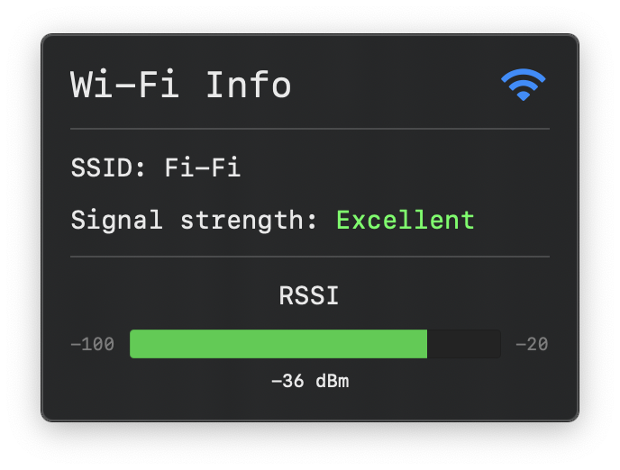

# SwiftUI Menu Bar App Demo

**SwiftUI Menu Bar App** demo for FinMacAdmin meetup 25.05.2023.



## Requirements

* macOS Ventura
* Xcode version: min. 15.0.1

## Setup

* Download or `git clone` this repo
* Edit `Team` value in Xcode project's `TARGETS` > `Signing & Capabilities`
* Build and Run

## List style menu bar app example

Edit `SwiftUIMenuBarAppDemoApp.swift`:

```swift
MenuBarExtra("Wi-Fi Info", systemImage: "wifi.square") {
    MenuBarList()
    // MenuBarWindow()
    // MoreGaugesView()
}
.menuBarExtraStyle(.menu)
// .menuBarExtraStyle(.window)
```

## Window style menu bar app example

Edit `SwiftUIMenuBarAppDemoApp.swift`:

```swift
MenuBarExtra("Wi-Fi Info", systemImage: "wifi.square") {
    // MenuBarList()
    MenuBarWindow()
    // MoreGaugesView()
}
// .menuBarExtraStyle(.menu)
.menuBarExtraStyle(.window)
```

## Bonus example with more gauges

Edit `SwiftUIMenuBarAppDemoApp.swift`:

```swift
MenuBarExtra("Wi-Fi Info", systemImage: "wifi.square") {
    // MenuBarList()
    // MenuBarWindow()
    MoreGaugesView()
}
// .menuBarExtraStyle(.menu)
.menuBarExtraStyle(.window)
```

## Links

* [Apple Developer Documentation - MenuBarExtra](https://developer.apple.com/documentation/swiftui/menubarextra)
* [Apple Developer Documentation - Gauge](https://developer.apple.com/documentation/swiftui/gauge)
* [Apple Developer Documentation - CWWiFiClient](https://developer.apple.com/documentation/corewlan/cwwificlient)
